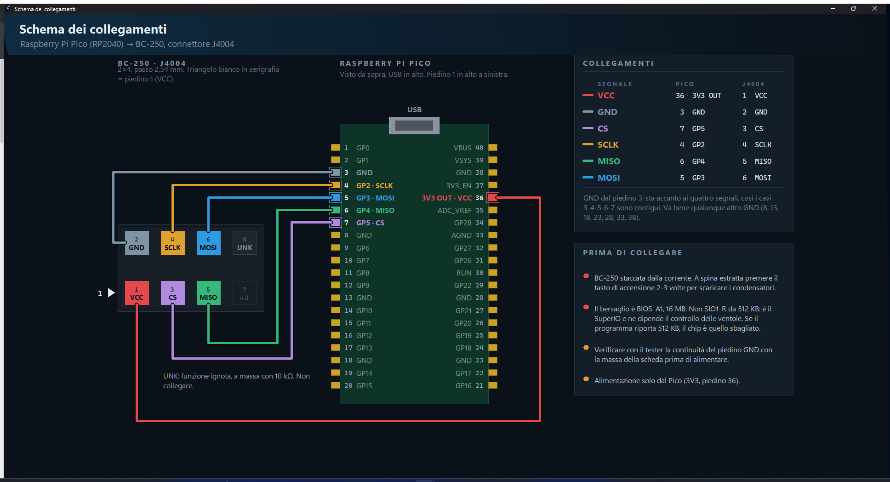

# SPIranha

**Program BIOS and SPI flash chips with a plain Raspberry Pi Pico.**

A Windows front-end to [flashrom](https://flashrom.org) that refuses to let you
write until you have done the checks. No dedicated programmer needed: a ~4 €
RP2040 board running `pico-serprog` is the whole hardware requirement.

> The first target is the **AMD BC-250** and its `J4004` header. The wiring
> diagram, the known fingerprints and the default layout are specific to that
> board; everything else — the safety rails, the chip map, the dry run, the
> image comparison — is not.



## Why another flashrom GUI

Because by the time you reach for an external programmer, the board is already
dead and you are in a hurry — which is exactly when people skip the checks.

SPIranha turns the things you are supposed to remember into things the program
will not let you skip. **The write button stays off** until all of these are
true:

| requirement | why |
|---|---|
| flashrom found | it does the actual erasing and writing |
| chip identified | and its size must match the image, byte for byte |
| **two reads that agree** | one read proves nothing over flying leads |
| **a dry run** | see below |
| layout and region picked | when writing a region rather than the whole chip |
| "board unplugged from mains" ticked | the chip is powered by the Pico alone |

Then confirmation requires **typing the word** `WRITE`. A "yes" is not enough.

## What it does that a command line does not

**Dry run — mandatory.** Before anything is erased, SPIranha computes *in
memory* what the flash will look like afterwards: the expected md5, how many
bytes change and in how many ranges, and — the useful one — whether the image
also differs **outside** the region you selected. That is the classic symptom of
a wrong layout or another board's image, and you find out with the chip
untouched. The computed image is then what the chip is verified against.

**Live chip map.** A grid of blocks, one per slice of flash, coloured by what is
happening to it: pending, read, erased, written, verified, mismatch. It is not
decorative — flashrom's `-V` prints an `E(start:end)` marker for every block it
erases and `W(start:end)` for the range it writes, and `--progress` gives per
stage percentages. SPIranha reads them off the stream. The status bar shows the
real percentage and how much time is left.

**Independent final verification.** When the write finishes, SPIranha re-reads
the whole chip and compares it byte for byte against the image the dry run
computed — separately from flashrom's own verification. Then it checks the
written region is *coherent*: not left all `0xFF` (erased and never rewritten),
not all `0x00`, and reports the known structures it contains (UEFI firmware
volumes, `NVAR` variable stores, `APCB`, `$PSP` directories).

**Link qualification.** Re-reads 256 KB twice at 12, 8, 4, 2, 1 MHz and 500 kHz
and stops at the fastest speed that gives two identical reads, then sets it.
Over dupont wires an unreliable link is the main risk, and this finds it in
seconds instead of two full 16 MiB reads.

**Image comparison and layout generation.** Given two images, it lists the
differing ranges aligned to 4 KB sectors, the true byte-level bounds, the size
and what is inside — and writes the flashrom layout file for you.

**Wiring diagram.** Drawn in code, so it scales without blurring and travels
inside the executable. It shows both ends: which Pico pin goes to which header
pad, with the pin-1 marker and the warnings that matter.

## Hardware

| | |
|---|---|
| programmer | any RP2040 board (Raspberry Pi Pico or clone) |
| firmware | [`pico-serprog`](https://codeberg.org/libreboot/pico-serprog) |
| wiring | six female-to-female jumper wires |

Default pin assignment (`spi0`), matching the stock `pico-serprog` firmware:

| signal | Pico pin | GPIO |
|---|---|---|
| SCLK | 4 | GP2 |
| MOSI | 5 | GP3 |
| MISO | 6 | GP4 |
| CS | 7 | GP5 |
| GND | 3 | — |
| 3V3 OUT | 36 | — |

GND is taken from pin 3 rather than one of the other grounds so that the five
signal wires sit on **contiguous pins 3-4-5-6-7** — a single five-way comb, plus
3V3 on pin 36.

⚠️ **Power the chip from the Pico only, with the target board unplugged.** Two
supplies on one bus do not work and can cause damage.

## Running it

You need Windows 10 or 11 (64-bit), Python 3.9+ with `pyserial`, and
`flashrom.exe`.

```bash
python SPIranha.pyw
```

To build the single-file executable — it creates its own virtualenv and leaves
the system Python alone:

```bash
python build.py --setup
```

That produces `dist\SPIranha.exe` (portable, flashrom embedded) and, if Inno
Setup 6 is installed, `dist\SPIranha-Setup-<version>.exe`.

### flashrom

`flashrom.exe` is **not in this repository**. flashrom.org publishes source
only, so it has to be built — [`flashrom/PROVENANCE.md`](flashrom/PROVENANCE.md)
documents exactly how, including the two options that matter:

- `-Dprogrammer=serprog,dummy` — `dummy` emulates a chip in memory and is what
  the test suite drives, so keep it;
- `-Drpmc=disabled` — **required**. With RPMC enabled the binary wants
  `libcrypto-3-x64.dll` and silently fails to start outside MSYS2.

Drop the result in `flashrom\` next to the sources. At runtime SPIranha looks
for it in the saved setting, inside itself, next to the executable, in
`flashrom\`, then on `PATH`.

## Tests

```bash
python tests\test_gui.py        # 21 checks, no hardware needed
python tests\test_full.py   # 37 checks, needs flashrom with 'dummy'
```

`test_full.py` drives the real window and the real flashrom against an
**emulated 16 MiB chip**: it starts from a stock BIOS image, writes one region
through a layout, and checks the result is byte-identical to the expected image
— dry run, block map, final verification and coherence check included. It also
proves the safety rails bite: a wobbling md5 must invalidate the read and block
the write.

Both skip with an explanation, rather than failing, when their inputs are
missing. The BC-250 images are not in this repository; point
`SPIRANHA_BIOS_BACKUP` at a folder containing them to run the full test.

## Interface

Italian and English, switchable live from the dropdown at the top right. The
layout is responsive: two columns when there is room, one when there is not.

The Italian documentation is in [`docs/it/LEGGIMI.md`](docs/it/LEGGIMI.md).

## Licence

SPIranha is released under the **GNU General Public License v2** — see
[LICENSE](LICENSE).

flashrom is a separate program, executed as a child process; SPIranha does not
link against it. flashrom itself is GPL-2.0 (a mix of `GPL-2.0-or-later` and
`GPL-2.0-only` files, which makes the resulting binary v2). **If you
redistribute a build with flashrom embedded, you must also make the exact
corresponding flashrom source available** — the simplest way is to attach the
same source tarball to the same release.

## Credits

- [flashrom](https://flashrom.org) — the code that actually talks to the chip.
- [`pico-serprog`](https://codeberg.org/libreboot/pico-serprog) by libreboot —
  the firmware that turns an RP2040 into a serprog programmer.
- [`mothenjoyer69/bc250-documentation`](https://github.com/mothenjoyer69/bc250-documentation)
  and [`elektricM/amd-bc250-docs`](https://github.com/elektricM/amd-bc250-docs)
  — the J4004 pinout, which the two document identically.
