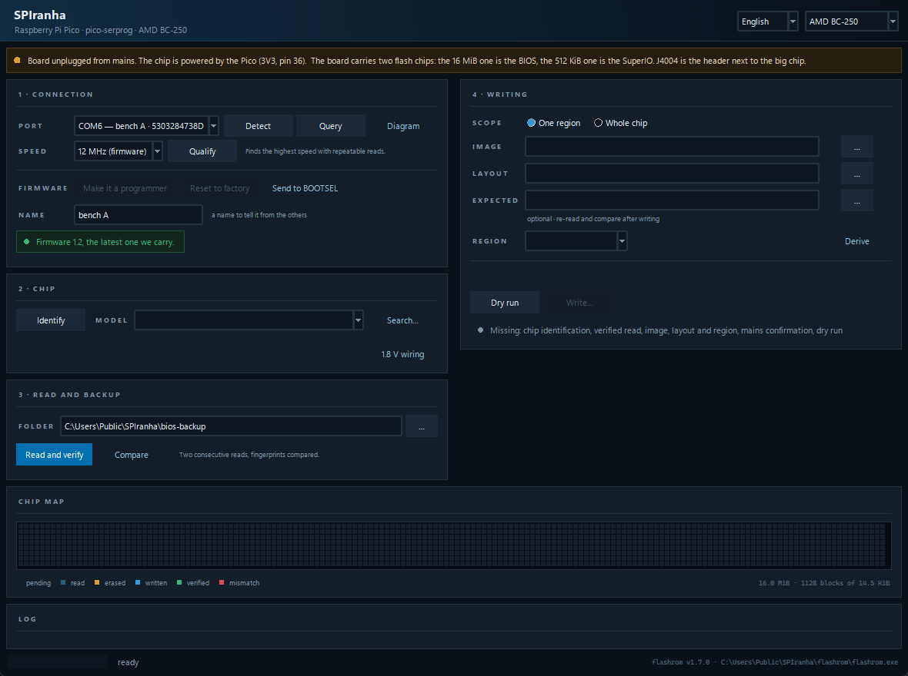
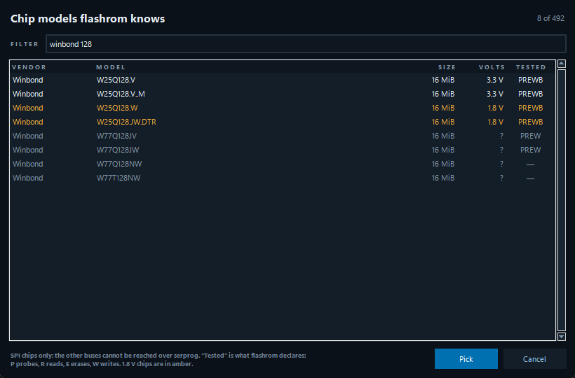
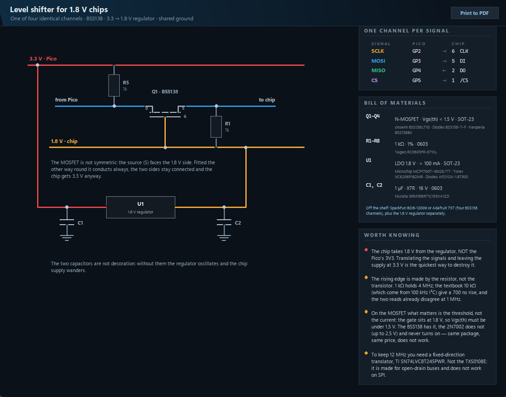
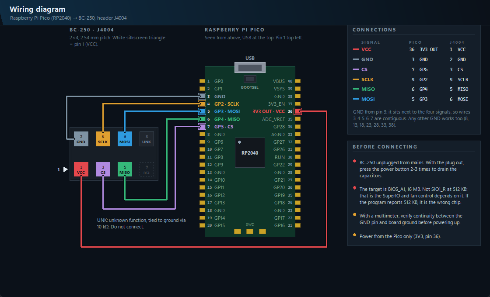
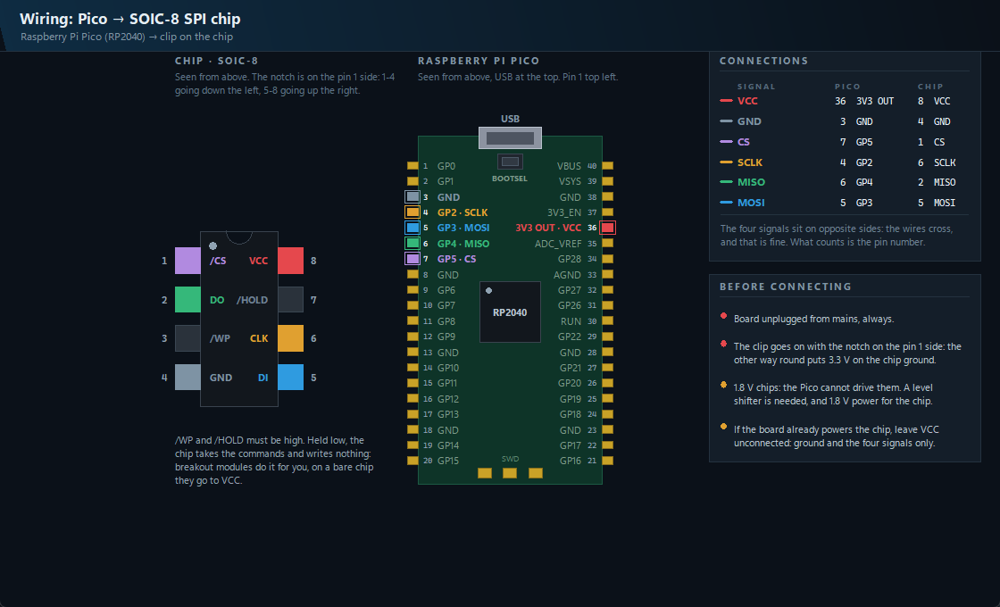

# SPIranha

**Program BIOS and SPI flash chips with a plain Raspberry Pi Pico.**

A Windows front-end to [flashrom](https://flashrom.org) that refuses to let you
write until you have done the checks. No dedicated programmer needed: a ~4 €
RP2040 board running `pico-serprog` is the whole hardware requirement.

> The first target is the **AMD BC-250** and its `J4004` header. The wiring
> diagram, the known fingerprints and the default layout are specific to that
> board; everything else — the safety rails, the chip map, the dry run, the
> image comparison — is not.



## Why another flashrom GUI

Because by the time you reach for an external programmer, the board is already
dead and you are in a hurry — which is exactly when people skip the checks.

SPIranha turns the things you are supposed to remember into things the program
will not let you skip. **The write button stays off** until all of these are
true:

| requirement | why |
|---|---|
| flashrom found | it does the actual erasing and writing |
| chip identified | and its size must match the image, byte for byte |
| **two reads that agree** | one read proves nothing over flying leads |
| **a dry run** | see below |
| layout and region picked | when writing a region rather than the whole chip |
| "board unplugged from mains" ticked | the chip is powered by the Pico alone |

Then confirmation requires **typing the word** `WRITE`. A "yes" is not enough.

## What it does that a command line does not

**Dry run — mandatory.** Before anything is erased, SPIranha computes *in
memory* what the flash will look like afterwards: the expected md5, how many
bytes change and in how many ranges, and — the useful one — whether the image
also differs **outside** the region you selected. That is the classic symptom of
a wrong layout or another board's image, and you find out with the chip
untouched. The computed image is then what the chip is verified against.

**Live chip map.** A grid of blocks, one per slice of flash, coloured by what is
happening to it: pending, read, erased, written, verified, mismatch. It is not
decorative — flashrom's `-V` prints an `E(start:end)` marker for every block it
erases and `W(start:end)` for the range it writes, and `--progress` gives per
stage percentages. SPIranha reads them off the stream. The status bar shows the
real percentage and how much time is left.

**Independent final verification.** When the write finishes, SPIranha re-reads
the whole chip and compares it byte for byte against the image the dry run
computed — separately from flashrom's own verification. Then it checks the
written region is *coherent*: not left all `0xFF` (erased and never rewritten),
not all `0x00`, and reports the known structures it contains (UEFI firmware
volumes, `NVAR` variable stores, `APCB`, `$PSP` directories).

**Link qualification.** Re-reads 256 KB twice at 12, 8, 4, 2, 1 MHz and 500 kHz
and stops at the fastest speed that gives two identical reads, then sets it.
Over dupont wires an unreliable link is the main risk, and this finds it in
seconds instead of two full 16 MiB reads.

**Image comparison and layout generation.** Given two images, it lists the
differing ranges aligned to 4 KB sectors, the true byte-level bounds, the size
and what is inside — and writes the flashrom layout file for you.

**Wiring diagram.** Drawn in code, so it scales without blurring and travels
inside the executable. It shows both ends: which Pico pin goes to which header
pad, with the pin-1 marker and the warnings that matter. The Pico is drawn with
the parts you actually look at to orient it — USB, the BOOTSEL button, the
RP2040 square with its pin-1 dot, the debug pads — because pin numbers alone do
not tell you which way up the board is, and upside down they are mirrored.

## Turning a bare RP2040 into the programmer

You do not need to find a UF2 and drag it around yourself. Hold **BOOTSEL**,
plug the board in, and SPIranha notices it within a couple of seconds and
offers to program it. It validates the firmware file first — magic numbers,
block numbering, payload size, RP2040 family ID — then copies it, waits for the
board to come back as a serial port, and **asks the firmware who it is**. Only
then does it say the programmer is ready.

There is also **Reset to factory**, which puts a board back to as-bought. That
one needs no downloaded file: SPIranha builds the `.uf2` itself, writing `0xFF`
across the flash. The bootloader erases each sector before writing it, so the
flash ends up erased and the board returns to BOOTSEL on its own.

And **Send to BOOTSEL** closes the loop: a programmer already running our
firmware can be put back into update mode over the wire, so after the first
time the button is never needed again. Upstream `pico-serprog` has no such
path — it is one of the two patches in `firmware/`.

**Every chip flashrom knows is in the list, and searchable.** The model
dropdown carries all 492 SPI chips this flashrom supports — the board profile's
own models first — and **Search…** opens a filter over them: type `winbond 128`
and eight rows remain. Each row shows the size, the working voltage, and what
flashrom claims to have actually done on that part (P probes, R reads, E erases,
W writes), with 1.8 V models in amber.

The list is read from `flashrom -L` at startup, so it is always the list of the
binary in use rather than a table of ours going quietly stale. Long names that
flashrom prints across several lines are stitched back together — the name it
accepts is the whole `GD25LQ128E/GD25LB128E/GD25LR128E/…`, and taking the first
line only would pick a model flashrom then refuses.



**1.8 V chips are recognised before they are destroyed.** The RP2040
speaks at 3.3 V and a 1.8 V chip is rated for 1.95 V on its pins: wired directly
it gets nearly twice what it expects. The other direction does not work either —
a logic one at 1.8 V never reaches the RP2040's input threshold of 2.31 V, so
MISO reads at random even in the lucky case where the chip survives.

There is no way to measure the voltage from here, but the model name says it:
in every SPI NOR family the 1.8 V version is one letter away from the 3 V one
(`MX25U` vs `MX25L`, `W25Q..JW` vs `W25Q..V`, `GD25LQ` vs `GD25Q`, `IS25WP` vs
`IS25LP`, `MT25QU` vs `MT25QL`). When SPIranha sees one, it says so in red and
the write stays blocked until you confirm a level shifter is in place. **A model
it cannot place is reported as unknown, never as 3.3 V** — assuming the safe
answer would be the opposite of safe.

**1.8 V wiring** opens a schematic for the adapter, with a real bill of
materials — manufacturer part numbers, values and packages, not "a MOSFET and a
regulator". That matters more than it sounds here: the part that looks
interchangeable is not. A 2N7002 is the same package at the same price as a
BSS138 and never turns on with its gate at 1.8 V, because what counts is the
gate threshold, not the current. And the pull-ups are 1 kΩ, not the textbook
10 kΩ: those come from 100 kHz I²C, and here the rising edge is made by the
resistor — 10 kΩ gives a 700 ns rise and the two reads already disagree at
1 MHz. With 1 kΩ the MOSFET version holds 4 MHz; to keep the full 12 MHz it
takes a fixed-direction translator (`SN74LVC8T245`), and not a `TXS0108E`, which
is built for open-drain buses and misbehaves on SPI. Ready-made boards are
listed too, for anyone who would rather buy one part than solder twelve.



**Print to PDF** turns that page into two printable A4 sheets — the circuit and
the bill of materials — with the colours inverted for paper, because a dark
schematic costs a cartridge and reads badly. A copy is in the repository:
[docs/level-shifter-1v8.pdf](docs/level-shifter-1v8.pdf).

**When flashrom does not know the chip, SPIranha asks the chip itself.**
It sends the JEDEC id command over the programmer and, if the chip has one,
reads its SFDP table for the real density. That separates two failures that look
identical from the outside and need opposite responses:

- the chip answers — it is simply not in flashrom's list, so force a model of
  the same size and family and carry on;
- the chip does not answer at all — the bus reads all `0xFF` or all `0x00`,
  which is not a chip. Trying more models is pointless; the wiring or the power
  is wrong.

**Every read compares itself with the previous backup.** After a verified
read, SPIranha finds the last dump taken in the same folder and says whether the
chip is unchanged or, if not, which sectors moved and where. It answers the
question that always comes up and that nobody can answer from memory — *is this
chip still how I left it?* — without anyone comparing two 32-character md5s by
eye.

**Board profiles.** The programmer has nothing board-specific about it —
the same four wires read any SPI flash — but the surroundings do, and the
surroundings are what gets people wrong: where to attach, which chip to expect,
which images are already known, and the warnings that apply to *this* machine.
A profile carries all of that: expected chip models and size, chip voltage,
known md5s, expected regions, its own warnings, and which wiring diagram to
open. The BC-250 is the first one; **Generic board** covers a clip on a bare
SOIC-8, which is the common case everywhere else.

A profile is what we expect, never what we impose: a chip that does not match
is reported and the work goes on. Adding a board is data — no code.

**Regions come out of the image itself.** A BIOS dump is not one block:
it carries a map saying where each piece lives. SPIranha reads that map and
turns it into a flashrom layout, so the region list fills itself in instead of
being typed by hand. Three maps cover nearly everything on a bench:

| map | where it comes from | what it gives |
|---|---|---|
| Intel descriptor | the first 4 KiB of any Intel-chipset flash | `fd`, `bios`, `me`, `gbe`, `ec` |
| FMAP | coreboot and its derivatives | every named area |
| AMD firmware structure | AMD boards, at one of six fixed offsets | `psp`, `apcb`, and the BIOS image |

It reads the **image**, not the chip: the dump you just took is already on disk,
and reading it costs nothing on the wire. The AMD side is why this is not a
paper feature here — the BC-250 has neither a descriptor nor an FMAP, and on its
real dump this finds the memory configuration and the 2 MiB BIOS image at
`0x00E02000`. The end-to-end test does exactly that and then has flashrom read
that region back byte for byte.

An image that says nothing about itself is reported as saying nothing. Nothing
is guessed.

**The programmer says which firmware it runs**, and SPIranha compares it
with the one it carries. If the board is behind, an **Update** button appears
and does the whole thing over the wire: back to BOOTSEL, copy, wait for the
board to come up again — then asks it again, because a copy that went through
is not the same as a board running the new code.

⚠️ Nothing else on an RP2040 can tell you this. The USB serial number is the
chip's unique id and never changes; the descriptors are identical across builds.
So the firmware reports its version inside the 16-byte serprog name, which
flashrom prints too:

```
serprog: Programmer name is "pico-serprog1.1"
```

A board answering with a bare `pico-serprog` is not unknown — it is older than
1.1, and it needs the BOOTSEL button once, because returning to BOOTSEL over the
wire is exactly what 1.1 added.

**Write protection is checked, not assumed.** Right after the chip is
identified, SPIranha asks it for its status register lock: the protected range,
and whether it is held by software or by hardware. If that range overlaps what
you are about to write, the write button stays off and says why.

⚠️ This matters more than it sounds. A protected chip does not refuse the
commands — it accepts them and does not change. Without the check, an erase and
a write both "succeed", and only the final verification tells you the chip still
holds the old image. Removing the lock is offered as a button, behind a typed
confirmation, because it changes the state of the chip itself and survives
unplugging everything. If the lock is held by the WP pin, no software can clear
it: the pin has to be pulled high.

**Name your boards.** With three identical Picos on the bench, "are you sure?"
tells you nothing about *which* one you are about to erase. Give each a name and
it follows the board everywhere: the port dropdown, the firmware row, the
confirmations.

⚠️ A board has **two different serial numbers**: one while the firmware runs
(16 hex digits, the flash unique id) and another in BOOTSEL (12 digits, from the
bootloader). Neither can be derived from the other — verified on the same board.
SPIranha learns the pairing by itself the first time it sees a board move between
the two states, and recognises it from either side afterwards.

**Erasing takes two consents**, and the second is bound to the identity: it
shows the serial of the board on that drive and asks you to retype its last four
characters. That forces a look at the board actually connected.

Nothing here can brick a board: the RP2040 bootloader lives in ROM, and a board
with an empty flash always comes back as `RPI-RP2`.

The firmware ships **in this repository**, together with the complete source
it was built from and the one-line patch needed to compile it with GCC 15 or
newer — see [`firmware/README.md`](firmware/README.md). It is GPLv3 and it is
not our code; the source is there because the licence asks for it.

Tested on real hardware: dropped onto a factory-fresh Pico, the board rebooted
and answered the serprog protocol one second later.

## Hardware



On any other board the clip goes on the chip itself, and the diagram changes
with the profile:




| | |
|---|---|
| programmer | any RP2040 board (Raspberry Pi Pico or clone) |
| firmware | [`pico-serprog`](https://codeberg.org/libreboot/pico-serprog) |
| wiring | six female-to-female jumper wires |

Default pin assignment (`spi0`), matching the stock `pico-serprog` firmware:

| signal | Pico pin | GPIO |
|---|---|---|
| SCLK | 4 | GP2 |
| MOSI | 5 | GP3 |
| MISO | 6 | GP4 |
| CS | 7 | GP5 |
| GND | 3 | — |
| 3V3 OUT | 36 | — |

GND is taken from pin 3 rather than one of the other grounds so that the five
signal wires sit on **contiguous pins 3-4-5-6-7** — a single five-way comb, plus
3V3 on pin 36.

⚠️ **Power the chip from the Pico only, with the target board unplugged.** Two
supplies on one bus do not work and can cause damage.

## Running it

You need Windows 10 or 11 (64-bit), Python 3.9+ with `pyserial`, and
`flashrom.exe`.

```bash
python SPIranha.pyw
```

To build the single-file executable — it creates its own virtualenv and leaves
the system Python alone:

```bash
python build.py --setup
```

That produces `dist\SPIranha.exe` (portable, flashrom embedded) and, if Inno
Setup 6 is installed, `dist\SPIranha-Setup-<version>.exe`.

### flashrom

`flashrom.exe` is **not in this repository**. flashrom.org publishes source
only, so it has to be built — [`flashrom/PROVENANCE.md`](flashrom/PROVENANCE.md)
documents exactly how, including the two options that matter:

- `-Dprogrammer=serprog,dummy` — `dummy` emulates a chip in memory and is what
  the test suite drives, so keep it;
- `-Drpmc=disabled` — **required**. With RPMC enabled the binary wants
  `libcrypto-3-x64.dll` and silently fails to start outside MSYS2.

Drop the result in `flashrom\` next to the sources. At runtime SPIranha looks
for it in the saved setting, inside itself, next to the executable, in
`flashrom\`, then on `PATH`.

## Tests

```bash
python tests\test_gui.py     # 165 checks, no hardware needed
python tests\test_full.py    # 44 checks, needs flashrom built with 'dummy'
```

`test_full.py` drives the real window and the real flashrom against an
**emulated 16 MiB chip**: it starts from a stock BIOS image, writes one region
through a layout, and checks the result is byte-identical to the expected image
— dry run, block map, final verification and coherence check included. It also
proves the safety rails bite: a wobbling md5 must invalidate the read and block
the write.

Both skip with an explanation, rather than failing, when their inputs are
missing. The BC-250 images are not in this repository; point
`SPIRANHA_BIOS_BACKUP` at a folder containing them to run the full test.

## Interface

Italian and English, switchable live from the dropdown at the top right. The
layout is responsive: two columns when there is room, one when there is not.

The Italian documentation is in [`docs/it/LEGGIMI.md`](docs/it/LEGGIMI.md).

## Licence

SPIranha is released under the **GNU General Public License v2** — see
[LICENSE](LICENSE).

Two other programs travel with it, and neither is covered by that licence:

- **flashrom** — GPL-2.0, executed as a child process; SPIranha does not link
  against it. Its binary is not in this repository.
  ⚠️ **If you redistribute a build with flashrom embedded, you must also make
  the exact corresponding flashrom source available** — the simplest way is to
  attach the same source tarball to the same release.
- **pico-serprog** — GPLv3, runs on the microcontroller. Its binary *is* here,
  and so is the source it was built from, in `firmware/pico-serprog/`.

## Credits

- [flashrom](https://flashrom.org) — the code that actually talks to the chip.
- [`pico-serprog`](https://codeberg.org/libreboot/pico-serprog) by libreboot —
  the firmware that turns an RP2040 into a serprog programmer.
- [`mothenjoyer69/bc250-documentation`](https://github.com/mothenjoyer69/bc250-documentation)
  and [`elektricM/amd-bc250-docs`](https://github.com/elektricM/amd-bc250-docs)
  — the J4004 pinout, which the two document identically.
